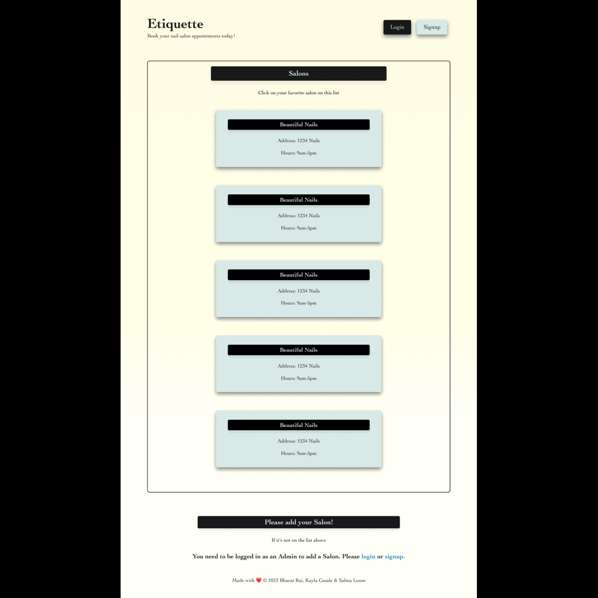

# Etiquette

## Description

Etiquette is a full-stack application where nail salon clients and artists can create an account, or log in.

Users on the homepage can find nail salons. They can go to the artist's profile, choose to make an appointmnet or view artists's previous work.

Whether you're looking to make a quick nail salon appointment, or to get inspired by a nail artist's work, we have the app for you. With a user-friendly interface and a variety of nail salon artists to choose from, you'll be getting your nails galmmed in no time!

## Table of Contents

- [Installation](#installation)
- [Usage](#usage)
- [Credits](#credits)
- [License](#license)
- [Questions](#questions)

## Installation

Go to [app page](https://etiquette.herokuapp.com/) and follow the prompts.

## Usage

- Click to `login` or `sign up` for a new profile.

- When you're directed to the Profile page you'll be able to choose from several nail salons.

- Click on an salon's link to view their details or to register an appointment.

- Add a time frame and a service and submit your form!

## Credits

### Developers:

- [Bharat Rai](https://github.com/bharatrai53)
- [Kayla Cassale](https://github.com/kaylacasale)
- [Salma Loum](https://github.com/SalmaLoum)

### Applications used:

- [Cloudinary](https://cloudinary.com/documentation/upload_widget)
- [Google Fonts](https://fonts.google.com/about)
- [Heroku](https://dashboard.heroku.com/)
- [Mongo DB](https://www.mongodb.com)
- [React](www.reactjs.org)
- [UCLA Extension Bootcamp](https://www.uclaextension.edu/?gclid=Cj0KCQiAgribBhDkARIsAASA5btdbwAz8x25r3b1deoRNIGxfkPFL11rAQMuCgQ7HYiqBH8CLr9CgLoaAktlEALw_wcB&gclsrc=aw.ds)

## License

MIT License

Copyright (c) 2023

Permission is hereby granted, free of charge, to any person obtaining a copy
of this software and associated documentation files (the "Software"), to deal
in the Software without restriction, including without limitation the rights
to use, copy, modify, merge, publish, distribute, sublicense, and/or sell
copies of the Software, and to permit persons to whom the Software is
furnished to do so, subject to the following conditions:

The above copyright notice and this permission notice shall be included in all
copies or substantial portions of the Software.

THE SOFTWARE IS PROVIDED "AS IS", WITHOUT WARRANTY OF ANY KIND, EXPRESS OR
IMPLIED, INCLUDING BUT NOT LIMITED TO THE WARRANTIES OF MERCHANTABILITY,
FITNESS FOR A PARTICULAR PURPOSE AND NONINFRINGEMENT. IN NO EVENT SHALL THE
AUTHORS OR COPYRIGHT HOLDERS BE LIABLE FOR ANY CLAIM, DAMAGES OR OTHER
LIABILITY, WHETHER IN AN ACTION OF CONTRACT, TORT OR OTHERWISE, ARISING FROM,
OUT OF OR IN CONNECTION WITH THE SOFTWARE OR THE USE OR OTHER DEALINGS IN THE
SOFTWARE.

## Questions

Reach us at the links below with additional questions:

- Bharat Rai: https://github.com/bharatrai53
- Kayla Cassale: https://github.com/kaylacasale
- Salma Loum: https://github.com/SalmaLoum
